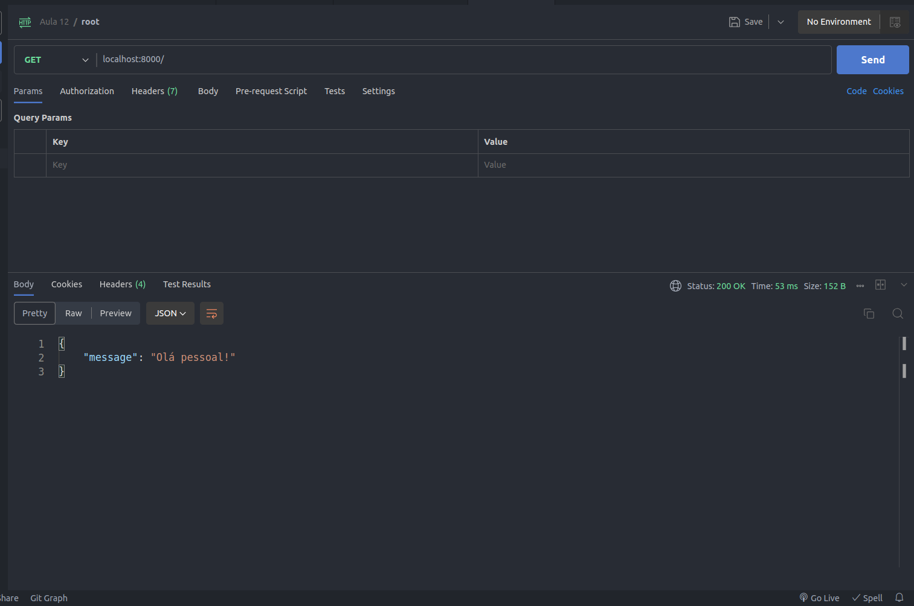

# Conteúdo desta aula

- Criação de uma API REST usando o framework FastAPI

## Criando um projeto novo

Vamos criar via terminal uma pasta nova para o nosso projeto:

```bash
mkdir aula12-api-rest-pratica
```

Em seguida, vamos abrir a nossa pasta com o Visual Studio Code:

```bash
code aula12-api-rest-pratica
```

## Configurando o ambiente

Em seguida, o que temos que fazer é configurar nosso projeto com um ambiente virtual, para termos um projeto apenas com as bibliotecas que ele precisa.

Para isso, com a pasta do nosso projeto aberta no VS Code, vamos abrir o terminal e digitar o comando abaixo:

```bash
python -m venv .venv
```

Agora, vamos ativar nosso ambiente virtual com o comando abaixo:

```bash
source .venv/bin/activate
```

## Criando o projeto e inicializando o repositório git

Na raiz do projeto, vamos criar uma pasta chamada `src`.

Em seguida, dentro da pasta `src` vamos criar um arquivo chamado `main.py`

Esse arquivo será o ponto de entrada da nossa aplicação Python.

### Inicializando o repositório git

No terminal, vamos digitar o seguinte comando:

```bash
git init
```

Em seguida, vamos criar um arquivo chamado `.gitignore` na raiz do nosso projeto e copiar o arquivo que está neste [link](https://github.com/github/gitignore/blob/main/Python.gitignore).

Este arquivo faz com que a nossa pasta .venv e outros arquivos que estão na raiz do projeto sejam ignorados pelo git.

Agora, vamos fazer nosso primeiro commit, adicionando todos os arquivos, através dos comandos abaixo:

```bash
git add .
git commit -m "Commit inicial"
```

## Instalando o framework

Para criarmos nossa API REST, vamos precisar de um servidor HTTP, que é fornecido pelo framework FastAPI, através de um conjunto de bibliotecas para criação de serviços web.

Não se preocupe com esses termos por hora. Vamos iniciar do básico, construindo API's simples e subindo a complexidade aos poucos.

### Instalando o FastAPI

Para instalar o FastAPI, vamos abrir o terminal e executar o seguinte comando:

```bash
pip install "fastapi[all]"
```

### Criando o arquivo requirements.txt

O arquivo `requirements.txt` é um arquivo gerado pelo pip, contendo todas bibliotecas que foram instaladas no nosso ambiente virtual.

Essas bibliotecas também são chamadas de dependências do projeto, pois, o projeto depende delas para poder funcionar.

Agora vamos executar o seguinte comando:

```bash
pip freeze > requirements.txt
```

## Criando a primeira rota

Vamos abrir o arquivo `main.py` dentro da pasta `src`.

Dentro dele vamos colocar o seguinte código:

```python
from fastapi import FastAPI

app = FastAPI()


@app.get("/")
def root():
    return {"message": "Olá pessoal!"}

```

O código acima faz o seguinte:

Primeiro importamos a classe FastAPI da biblioteca fastapi:

```python
from fastapi import FastAPI
```

Na sequencia, criamos uma instancia da classe FastAPI com o nome `app`:

```python
app = FastAPI()
```

Por fim, criamos nossa primeira rota, usando a instancia do FastAPI, dizendo que a função `root()` é uma rota do tipo GET e ela irá retornar um objeto JSON com uma propriedade `message` com o valor `"Olá pessoal!"`:

```python
@app.get("/")
def root():
    return {"message": "Olá pessoal!"}
```

## Executando o projeto

Após criarmos nossa primeira rota, vamos precisar testar e validar se está tudo funcionando.

Para executar o nosso projeto, vamos até o terminal e vamos executar o seguinte comando:

```bash
uvicorn src.main:app --reload
```

A saída do terminal deverá ser algo parecido com isso:

```bash
INFO:     Will watch for changes in these directories: ['/home/cezar/dev/projects/unimater/DAW/aula12-api-rest-pratica']
INFO:     Uvicorn running on http://127.0.0.1:8000 (Press CTRL+C to quit)
INFO:     Started reloader process [189580] using WatchFiles
INFO:     Started server process [189629]
INFO:     Waiting for application startup.
INFO:     Application startup complete.
```

## Instalando o Postman para testar nossa aplicação

Para nos ajudar em nosso desenvolvimento, vamos instalar uma extensão no nosso VS Code chamada Postman:
1 - Copie o comando a seguir: `ext install Postman.postman-for-vscode`
2 - Pressione as teclas `Ctrl + P`, cole o comando acima e pressione `Enter`

## Testando a primeira rota

Após instalar o Postman, vamos clicar no ícone do Postman na barra de atividades e em seguida clicamos em `New HTTP Request`.

Na barra de endereço, vamos digitar `http://localhost:8000/` e clicamos em `Send`.

O retorno deve ser parecido com a imagem abaixo:


## O que são request e response?

Imagine o seguinte cenário: em uma conversa entre duas pessoas, sempre temos um transmissor e um receptor, ora somos transmissores, quando emitimos uma mensagem e ora somos receptores, quando recebemos uma mensagem e vice-versa.

Tanto a request quanto a response são consideradas como mensagens que são trocadas entre o servidor e o usuário.

Em um servidor web possuí o comportamento de request e response, onde nós como usuários de uma API somos os emissores fazendo uma request, ou requisição HTTP, para o servidor. Assim o servidor recebe uma mensagem, ele vai trata-la e responder para o usuário através de uma response, a qual sempre vai conter um status code, bem como pode ter algum conteúdo no corpo da resposta.

Reforçando o conceito das aulas anteriores, segue um exemplo de como são as mensagens de request e response:


Caso queira se aprofundar ainda mais, acesse esse [link](https://developer.mozilla.org/pt-BR/docs/Web/HTTP/Messages) da MDN.


## Métodos HTTP

Para representar ações do mundo real, um servidor HTTP consegue tratar algumas operações, também chamadas de métodos HTTP.

Isso torna as rotas das API's mais semânticas e claras, o que facilita muito o entendimento de o que exatamente cada rota faz e o que ela pode retornar ou não.

### Método GET

Por padrão, para obtermos uma lista de usuários de uma API que está conectada em nosso banco de dados, a possível rota a ser usada seria `http://localhost:8000/users` a qual estaria implementada com método HTTP `GET`.

### Método POST

Caso precisássemos criar um novo usuário, poderíamos fazer uma requisição para o mesmo endereço do exemplo anterior, `http://localhost:8000/users`, porém, usaríamos o método `POST`.

Os dados do usuário são enviados dentro do `body`, ou seja o corpo da nossa request e dentro da nossa API eles são tratados de acordo com as regras de negócio da nossa aplicação.

### Método PUT e método PATCH

Os métodos `PUT` e `PATCH` são usados para quando queremos atualizar os dados em nossa API.

O método `PUT` é utilizado em situações onde queremos atualizar por completo o recurso. Seguindo o nosso exemplo do usuário, caso desejássemos alterar todas as informações dele, passaríamos através do body as informações e todos os dados seriam atualizados.

Já o método `PATCH` é utilizado em situações onde queremos atualizar apenas algumas informações de um determinado recurso. Ainda com o nosso exemplo do usuário, poderíamos por exemplo mudar apenas o seu nome, enviando no `body` essa informação e as demais informações não seriam alteradas.

### Método DELETE

O método `DELETE` é usado para efetuarmos a exclusão de um recurso através da nossa API.

Geralmente, ao fazer uma requisição de `DELETE`, precisamos informar na rota qual o identificador do recurso que queremos excluir.

O retorno dessa chamada geralmente é com um `body` vazio e com o status code 204 ou com uma mensagem no body e o status code 200.


## Criando uma rota do tipo POST
